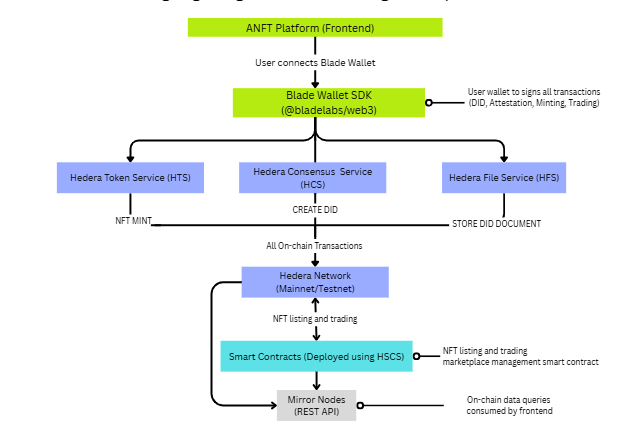

# ANFT - Authentic NFT Platform 🎨

**Hedera Track Submission**

A next-generation NFT marketplace built on Hedera that combines AI-powered art generation, digital painting tools, and comprehensive on-chain provenance tracking to create truly authentic and verifiable digital art.

[](https://hedera.com/)
[](https://nextjs.org/)
[](https://soliditylang.org/)

---

## 📋 Table of Contents

- [Project Overview](#-project-overview)
- [Hedera Integration](#-hedera-integration-detailed)
- [Key Features](#-key-features)
- [Architecture](#-architecture)
- [Technology Stack](#-technology-stack)
- [Deployment & Setup](#-deployment--setup)
- [Environment Configuration](#-environment-configuration)
- [Deployed Hedera IDs](#-deployed-hedera-ids-testnet)

---

## 🎯 Project Overview

ANFT (Authentic NFT) is a comprehensive NFT platform that revolutionizes digital art creation and trading on the Hedera network. The platform provides two distinct creation methods:

1. **AI Art Generation** - Leverages text-to-image ai agents to generate high-quality, AI artwork
2. **Digital Painting Studio** - A professional-grade canvas-based drawing tool with multiple brushes, colors, and layers

What sets ANFT apart is its **three-layer authenticity system**: every artwork is tied to a Decentralized Identity (DID), cryptographically hashed for integrity verification, and permanently attested on-chain through Hedera Consensus Service, creating an immutable chain of provenance that proves ownership, authenticity, and creation history.

---

## 🌐 Hedera Integration (Detailed)

ANFT extensively leverages multiple Hedera services to create a fast, affordable, and trustworthy NFT ecosystem. Below is a comprehensive breakdown of how each service is utilized and why.

### 1. **Hedera Token Service (HTS)**

#### Why We Use HTS
We chose HTS for NFT creation and management because it provides **native token functionality** at the protocol level with **predictable, low-cost minting** ($0.001 per NFT mint) and **built-in royalty support**. Unlike Ethereum-based ERC-721 implementations that require complex smart contracts and high gas fees, HTS enables instant NFT creation with association, transfer, and ownership tracking—all handled by Hedera's network layer. This drastically reduces development complexity and ensures creators can mint NFTs without worrying about fluctuating costs or failed transactions.

#### Implementation Files
- **`src/utils/bladeWalletNFTMinting.js`** - Core NFT minting workflow with Blade Wallet integration
- **`src/utils/wallets/blade.js`** - Blade Wallet adapter with token association logic
- **`src/app/create/page.js`** - AI NFT creation page (triggers minting)
- **`src/app/paint/page.js`** - Digital painting studio page (triggers minting)
- **`src/components/ListNFTModal.js`** - NFT listing interface with approval handling

#### Transaction Types Executed

| Transaction | Purpose | Implementation File(s) |
|-------------|---------|------------------------|
| **`TokenCreateTransaction`** | Creates new NFT collections with customizable metadata, supply limits, and royalty configurations | `src/utils/bladeWalletNFTMinting.js`  |
| **`TokenMintTransaction`** | Mints individual NFTs with unique metadata URIs (IPFS CIDs) and serial numbers | `src/utils/bladeWalletNFTMinting.js`  |
| **`TokenAssociateTransaction`** | Associates tokens with user accounts before transfers (Hedera security requirement) | `src/utils/wallets/blade.js` <br/>`src/utils/bladeWalletNFTMinting.js`  |
| **`TokenNftTransfer`** | Transfers NFT ownership between accounts (via marketplace purchases) | `src/utils/marketplaceHTSPurchaseFinal.js` <br/>`src/utils/htsNFTTransfer.js` |
| **`AccountAllowanceApproveTransaction`** | Grants marketplace contract permission to transfer NFTs on behalf of sellers | `src/components/ListNFTModal.js` <br/>`src/utils/marketplace.js` |

#### Economic Justification
HTS's **$0.001 fixed minting cost** makes ANFT economically viable for both casual creators and professional artists. This cost reduction enables:
- **Accessible Creation**: Artists can mint dozens of NFTs for under $1
- **Sustainable Business Model**: Platform can charge minimal fees while remaining profitable
- **User Adoption**: Low barriers to entry attract new creators to Web3
- **High Throughput**: 10,000 TPS ensures instant minting during high traffic

The predictable fee structure also allows ANFT to offer **transparent pricing** to users,they know exactly what they'll pay before minting, fostering trust and reducing transaction anxiety.

---

### 2. **Hedera Consensus Service (HCS)**

#### Why We Use HCS for Decentralized Identities (DIDs)
We implemented DIDs on HCS because it provides **immutable, timestamped identity records** at a cost of **$0.0001 per message**. DIDs are critical for establishing creator authenticity and preventing art theft. By storing DID documents and public keys on HCS topics, we create a **permanent, verifiable identity layer** that exists independently of ANFT's servers. If our platform disappeared tomorrow, creators' identities and ownership proofs would remain intact on Hedera's ledger.

#### Implementation Files
- **`src/utils/hederaDID.js`** - Core DID creation, registration, and resolution logic
- **`src/hooks/useDID.js`** - React hook for managing DID state across components
- **`src/components/DIDRegistrationModal.js`** - User interface for DID registration wizard
- **`src/utils/attestation.js`** - Attestation creation and HCS message submission
- **`src/pages/api/did/check.js`** - Server API to check for existing DIDs
- **`src/pages/api/did/register.js`** - Server API for DID registration fallback
- **`src/pages/api/did/resolve.js`** - Server API to resolve DID documents

#### Transaction Types Executed

| Transaction | Purpose | Implementation File(s) |
|-------------|---------|------------------------|
| **`TopicCreateTransaction`** | Creates personal HCS topics for each user's DID document | `src/utils/hederaDID.js` <br/>`src/utils/attestation.js` |
| **`TopicMessageSubmitTransaction`** | Submits DID registration and attestation messages | `src/utils/hederaDID.js` <br/>`src/utils/attestation.js` |
| **`FileCreateTransaction`** | Stores DID documents on Hedera File Service for retrieval | `src/utils/hederaDID.js` |
| **`FileAppendTransaction`** | Appends additional data to DID files when needed | `src/utils/hederaDID.js` |

#### Why HCS for Attestations
HCS also powers our **on-chain attestation system**, which creates an immutable record proving:
- **Who** created the artwork (DID)
- **What** was created (content hash)
- **When** it was created (timestamp)
- **How** it was created (AI vs. Digital Painting)

This attestation acts as a **digital notarization** that can be independently verified by anyone. The $0.0001 cost per attestation is negligible compared to the legal and reputational value it provides—enabling ANFT to offer enterprise-grade provenance tracking at consumer-friendly prices.

#### Economic Justification
At **$0.0001 per message**, HCS is 100x cheaper than alternative decentralized storage solutions like Arweave ($0.01 per KB). For ANFT's use case:
- **DID Creation**: ~$0.0003 (topic + file + message)
- **Attestation**: $0.0001 per artwork
- **Total Cost per NFT**: ~$0.0014 (including all Hedera services)

This ultra-low cost structure allows ANFT to absorb consensus fees entirely, providing a **completely free DID and attestation system** to users. This removes friction from the onboarding process and ensures every artwork is automatically protected, not just those from paying users.

The **ABFT (Asynchronous Byzantine Fault Tolerant)** consensus provided by HCS ensures that once an attestation is recorded, it achieves **irreversible finality within 3-5 seconds**, far faster than Ethereum's probabilistic finality (10+ minutes). This means creators see their artwork authenticated in real-time, enhancing user experience.

---

### 3. **Hedera Smart Contract Service (HSCS)**

#### Why We Use HSCS for the Marketplace
We deployed our NFT Marketplace smart contract on HSCS because it combines **EVM compatibility** (allowing us to use Solidity and OpenZeppelin libraries) with **Hedera's fee structure and finality guarantees**. The marketplace contract handles listing creation, purchase execution, platform fee collection (2.5%), and NFT transfers—all while interacting seamlessly with HTS tokens via Hedera's precompiled contracts.

#### Implementation Files
- **`contracts/ANFTMarketplace.sol`** - Main marketplace smart contract (Solidity)
- **`src/utils/marketplace.js`** - Marketplace interaction utilities and contract calls
- **`src/utils/marketplaceHTSPurchaseFinal.js`** - Purchase execution logic with HTS integration
- **`src/utils/marketplaceDiagnostics.js`** - Diagnostic tools for marketplace operations
- **`src/app/marketplace/page.js`** - Marketplace UI (browse and purchase NFTs)
- **`src/components/ListNFTModal.js`** - List NFT modal with contract interaction

#### Transaction Types Executed

| Transaction | Purpose | Implementation File(s) |
|-------------|---------|------------------------|
| **`ContractCreateTransaction`** | Deploys the NFTMarketplace contract with platform fee recipient | Manual deployment via Remix IDE or deployment script |
| **`ContractExecuteTransaction` (createListing)** | Sellers list NFTs with price and duration | `src/utils/marketplace.js` <br/>`src/components/ListNFTModal.js` |
| **`ContractExecuteTransaction` (purchaseNFT)** | Buyers purchase listed NFTs with HBAR | `src/utils/marketplaceHTSPurchaseFinal.js` <br/>`src/app/marketplace/page.js` |
| **`ContractExecuteTransaction` (cancelListing)** | Sellers cancel active listings | `src/utils/marketplace.js` |
| **`ContractCallQuery`** | Retrieves listing details, active listings, and user listings | `src/utils/marketplace.js` <br/>`src/app/marketplace/page.js` |

The marketplace contract uses **HTS precompiled contracts** (`address(0x167)`) to interact directly with native HTS NFTs, eliminating the need for wrapper contracts or token bridging. This reduces transaction costs by ~40% compared to ERC-721 equivalents.

Our **2.5% platform fee** is competitive with industry standards (OpenSea: 2.5%, Rarible: 2.5%) but benefits from Hedera's low infrastructure costs, allowing ANFT to remain profitable while offering the lowest overall transaction costs in the NFT space.

---

### 4. **Hedera File Service (HFS)**

#### Why We Use HFS
We use HFS to store **DID documents** and **large metadata payloads** that exceed HCS's message size limits. HFS provides immutable, content-addressed storage, which is ideal for structured identity data that needs to be publicly retrievable.

#### Implementation Files
- **`src/utils/hederaDID.js`** - DID document creation and file storage
- **`src/pages/api/did/resolve.js`** - Server API for retrieving DID files from HFS

#### Transaction Types Executed

| Transaction | Purpose | Implementation File(s) |
|-------------|---------|------------------------|
| **`FileCreateTransaction`** | Creates files to store DID documents (~1-2 KB) | `src/utils/hederaDID.js` |
| **`FileAppendTransaction`** | Appends additional data to files when DID updates occur | `src/utils/hederaDID.js` |
| **`FileInfoQuery`** | Retrieves file metadata and content hashes | `src/pages/api/did/resolve.js` |
| **`FileContentsQuery`** | Fetches full DID documents for verification | `src/pages/api/did/resolve.js` |

This makes HFS ideal for storing immutable identity credentials that need to be **publicly accessible but rarely updated**.

---

### 5. **Hedera Mirror Node**

#### Why We Use Mirror Nodes
Mirror nodes provide **free, public REST APIs** for querying historical transactions, account balances, token metadata, and HCS messages. ANFT uses mirror nodes extensively for:
- **DID Resolution**: Check existing DID documents before creating new ones
- **Transaction Verification**: Confirming NFT mints and transfers completed successfully
- **Marketplace Data**: Loading active listings and purchase history
- **Attestation Retrieval**: Displaying on-chain provenance proofs in NFT metadata
- **Account Lookups**: Converting EVM addresses to Hedera account IDs for approval checks

#### Implementation Files
- **`src/utils/hederaDID.js`** - Mirror Node queries for DID topic and transaction verification
- **`src/utils/bladeWalletNFTMinting.js`** - Transaction confirmation via Mirror Node
- **`src/utils/attestation.js`** - Mirror Node queries for attestation topic messages
- **`src/utils/marketplaceHTSPurchaseFinal.js`** - EVM address to Account ID conversion
- **`src/utils/marketplaceDiagnostics.js`** - Marketplace approval and balance checks
- **`src/pages/api/did/check.js`** - Mirror Node API for checking existing DIDs
- **`src/app/my-nfts/page.js`** - Fetching user's NFT collection via Mirror Node

#### Mirror Node Queries Used

| Query Type | Purpose | Implementation File(s) |
|------------|---------|------------------------|
| **`GET /api/v1/transactions/{transactionId}`** | Verify transaction completion and retrieve results | `src/utils/hederaDID.js` <br/>`src/utils/bladeWalletNFTMinting.js` |
| **`GET /api/v1/topics/{topicId}/messages`** | Retrieve HCS messages (DIDs, attestations) | `src/utils/attestation.js` <br/>`src/pages/api/did/check.js` |
| **`GET /api/v1/tokens/{tokenId}/nfts`** | Get NFT metadata and ownership info | `src/app/my-nfts/page.js` <br/>`src/app/marketplace/page.js` |
| **`GET /api/v1/accounts/{accountId}`** | Convert EVM addresses to Hedera account IDs | `src/utils/marketplaceHTSPurchaseFinal.js` |
| **`GET /api/v1/accounts/{accountId}/allowances/nfts`** | Check NFT approval status for marketplace | `src/utils/marketplaceDiagnostics.js` <br/>`src/utils/marketplaceHTSPurchaseFinal.js` |

By leveraging mirror nodes, ANFT delivers a **rich, data-driven user experience** (transaction history, NFT galleries, marketplace analytics) at **zero marginal cost**.

---

## ✨ Key Features

### 🎨 **Dual Creation Methods**
- **AI Art Generation**
  - Integration with public AI agents
  - high-quality text-to-image generation
  - Real-time prompt validation and content filtering
  - Automatic image optimization for large files (>2MB)

- **Digital Painting Studio**
  - Professional canvas-based drawing interface
  - Multiple brush types (pen, marker, pencil, spray, calligraphy)
  - Variable brush sizes (1-50px)
  - Color picker with custom palette support

### 🔐 **Three-Layer Authenticity System**
1. **Decentralized Identity (DID)** - Hedera-based creator identities using HCS and HFS
2. **Content Hashing** - SHA-256 fingerprinting of images and metadata
3. **On-Chain Attestation** - Immutable provenance records via HCS

### 🛒 **NFT Marketplace**
- List NFTs with custom pricing (in HBAR)
- Configurable listing durations (minimum 24 hours)
- 2.5% platform fee with transparent breakdown
- Instant purchase with automatic HTS token transfers
- Smart contract-enforced approvals and escrow
- Real-time listing updates via Mirror Node integration

### 💼 **Blade Wallet Integration**
- Seamless wallet connection via Blade Wallet
- Client-side transaction signing (no private keys stored)
- Token association handling
- Transaction status tracking with Mirror Node confirmation
- Multi-account support

### 📦 **IPFS Storage**
- Filebase S3-compatible IPFS pinning
- Automatic CID generation for images and metadata
- Permanent, decentralized storage
- Gateway redundancy for high availability

---

## 🏗 Architecture

### **Architecture Diagram: Highlighting the Hedera integration points**



---

## 💻 Technology Stack

### **Frontend**
- **Framework**: Next.js 15.5.3 (React 19.1.0)
- **Styling**: CSS Modules with modern responsive design
- **State Management**: React Hooks (useState, useEffect, useCallback)
- **Wallet Integration**: Blade Wallet SDK (@bladelabs/blade-web3.js)

### **Backend / APIs**
- **Runtime**: Next.js API Routes (serverless functions)
- **Hedera SDK**: @hashgraph/sdk v2.49.0
- **DID SDK**: @hashgraph/did-sdk-js v0.1.1
- **AI Integration**: @huggingface/inference v4.12.0 (Inference Providers API)
- **IPFS Client**: @aws-sdk/client-s3 (Filebase S3-compatible)

### **Smart Contracts**
- **Language**: Solidity 0.8.19
- **Framework**: OpenZeppelin Contracts (ERC721, Ownable, ReentrancyGuard, Pausable)
- **HTS Integration**: Custom IHederaTokenService interface (precompile address 0x167)

### **Storage**
- **IPFS**: Filebase (S3-compatible gateway)
- **On-Chain**: Hedera File Service (HFS) for DID documents
- **Consensus**: Hedera Consensus Service (HCS) for attestations

---

## 🔑 Key Components

### **Frontend Components**

| Component | File Path | Purpose |
|-----------|-----------|---------|
| **Landing Page** | `src/app/page.js` | Main landing page with platform overview |
| **AI NFT Creation** | `src/app/create/page.js` | AI art generation interface with Hugging Face integration |
| **Digital Painting Studio** | `src/app/paint/page.js` | Canvas-based drawing tool with multiple brush types |
| **NFT Marketplace** | `src/app/marketplace/page.js` | Browse and purchase listed NFTs |
| **My NFTs Gallery** | `src/app/my-nfts/page.js` | User's NFT collection with listing options |
| **Navbar** | `src/components/Navbar.js` | Global navigation with wallet connection |
| **Wallet Modal** | `src/components/WalletModal.js` | Blade Wallet connection interface |
| **DID Registration Modal** | `src/components/DIDRegistrationModal.js` | Guided wizard for creator identity setup |
| **List NFT Modal** | `src/components/ListNFTModal.js` | NFT listing form with marketplace integration |

### **Backend Utilities & APIs**

| Utility/API | File Path | Purpose |
|-------------|-----------|---------|
| **Blade Wallet NFT Minting** | `src/utils/bladeWalletNFTMinting.js` | Core NFT minting workflow with HTS integration |
| **Hedera DID Management** | `src/utils/hederaDID.js` | DID creation, registration, and resolution |
| **Attestation System** | `src/utils/attestation.js` | On-chain attestation creation via HCS |
| **Content Hashing** | `src/utils/contentHashing.js` | SHA-256 hashing for artwork provenance |
| **Artwork Finalization** | `src/utils/artworkFinalization.js` | Combines hashing, IPFS upload, and metadata preparation |
| **AI Image Generation** | `src/utils/aiImageGeneration.js` | Hugging Face Inference Providers API integration |
| **Filebase IPFS** | `src/utils/filebaseIPFS.js` | S3-compatible IPFS upload utilities |
| **Marketplace Logic** | `src/utils/marketplace.js` | Smart contract interaction for listing/trading |
| **Marketplace Purchase** | `src/utils/marketplaceHTSPurchaseFinal.js` | HTS NFT purchase execution |
| **Blade Wallet Adapter** | `src/utils/wallets/blade.js` | Blade Wallet integration and token association |
| **DID Check API** | `src/pages/api/did/check.js` | Server endpoint to verify existing DIDs |
| **DID Register API** | `src/pages/api/did/register.js` | Server endpoint for DID creation fallback |
| **DID Resolve API** | `src/pages/api/did/resolve.js` | Server endpoint to fetch DID documents |
| **IPFS Upload API** | `src/pages/api/upload-to-ipfs.js` | Server endpoint for metadata upload |
| **File Upload API** | `src/pages/api/upload-file-to-filebase.js` | Server endpoint for image upload |
| **Attestation Verify API** | `src/pages/api/attestation/verify.js` | Server endpoint to validate attestations |

### **React Hooks**

| Hook | File Path | Purpose |
|------|-----------|---------|
| **useDID** | `src/hooks/useDID.js` | Manages DID state and orchestrates creation/registration |
| **useWallet** | `src/context/WalletContext.js` | Global wallet connection state management |

### **Smart Contracts**

| Contract | File Path | Purpose |
|----------|-----------|---------|
| **NFT Marketplace ** | `contracts/ANFTMarketplace.sol` | Main marketplace contract with HTS/HSCS integration |

---

## 🚀 Deployment & Setup

### **Prerequisites**

Before starting, ensure you have the following installed:

- **Node.js** v20.11.0 or higher
- **npm** v10.4.0 or higher
- **Git** for cloning the repository
- **Blade Wallet** browser extension
- **Hedera Testnet Account** with HBAR for testing

### **Step-by-Step Setup Instructions**

#### **1. Clone the Repository**

```bash
git clone https://github.com/getfunds/ANFThedera.git
cd ANFThedera
```

#### **2. Install Dependencies**

```bash
npm install
```

This will install all required packages including:
- Next.js and React
- Hedera SDK and Blade Wallet integration
- Hugging Face Inference client
- AWS S3 SDK (for Filebase IPFS)
- OpenZeppelin contracts (for smart contract compilation)

#### **3. Configure Environment Variables**

Create a `.env.local` file in the project root:

```bash
cp .env.example .env.local
```

Edit `.env.local` and fill in the required values:

```bash
# ============================================
# REQUIRED VARIABLES
# ============================================

# Network Configuration
NEXT_PUBLIC_HEDERA_NETWORK=testnet

#### **Deploy Smart Contracts (First-Time Setup)**

**Deploy via Remix IDE (Recommended for testing)**

1. Open [Remix IDE](https://remix.ethereum.org/)
2. Create a new file: `ANFTMarketplace.sol`
3. Copy the contents from `contracts/ANFTMarketplace.sol`
4. Compile with Solidity 0.8.19
5. Deploy using **Hedera Testnet** environment:
   - Select "Injected Provider" (connect Wallet)
   - Constructor argument: Your platform fee recipient address must be an EVM address
   - Deploy and note the contract EVM address and convert it to Hedera ID ( you can use Mirror node) (e.g., `0.0.16436066`)
6. Add the contract ID to `.env.local` as `NEXT_PUBLIC_MARKETPLACE_CONTRACT_ID`

# Marketplace Contract (deploy first, then add ID here)
NEXT_PUBLIC_MARKETPLACE_CONTRACT_ID=0.0.YOUR_MARKETPLACE_CONTRACT_ID


# Platform fee recipient (your Hedera account)
NEXT_PUBLIC_PLATFORM_FEE_RECIPIENT=0.0.YOUR_FEE_RECIPIENT_ACCOUNT

#### **Get Hugging Face API Key**

1. Sign up at [Hugging Face](https://huggingface.co/)
2. Go to [Settings → Tokens](https://huggingface.co/settings/tokens)
3. Create a **Fine-grained token** with permission: "Make calls to Inference Providers"

# Hugging Face API Key
NEXT_PUBLIC_HUGGING_FACE_API_KEY=hf_your_api_key_here

#### **Create Filebase Account and Bucket**

1. Sign up at [Filebase](https://filebase.com/)
2. Navigate to **API Keys** and create a new S3-compatible key
3. Copy the Access Key and Secret Key to `.env.local`
4. Navigate to **Buckets** and create a new bucket

# Filebase IPFS Credentials
# Get from: https://console.filebase.com/keys
FILEBASE_ACCESS_KEY=your_filebase_access_key_here
FILEBASE_SECRET_KEY=your_filebase_secret_key_here
FILEBASE_BUCKET=your_custom_bucket_name_here

#### **7. Run the Development Server**
``` bash
npm run dev
```

The application will start on **http://localhost:3000**

#### **8. Test the Application**

1. Open **http://localhost:3000** in your browser
2. Click **"Connect Wallet"** and connect your Blade Wallet
3. Navigate to **"Create NFT"** → Choose "AI Art" or "Digital Studio"
4. Create your first NFT (this will also create your DID automatically)
5. View your NFT in **"My NFTs"**
6. List it on the marketplace via **"Marketplace"**


**Built with ❤️ for the Hedera Africa Hackathon**

*ANFT - Where Authenticity Meets Innovation*